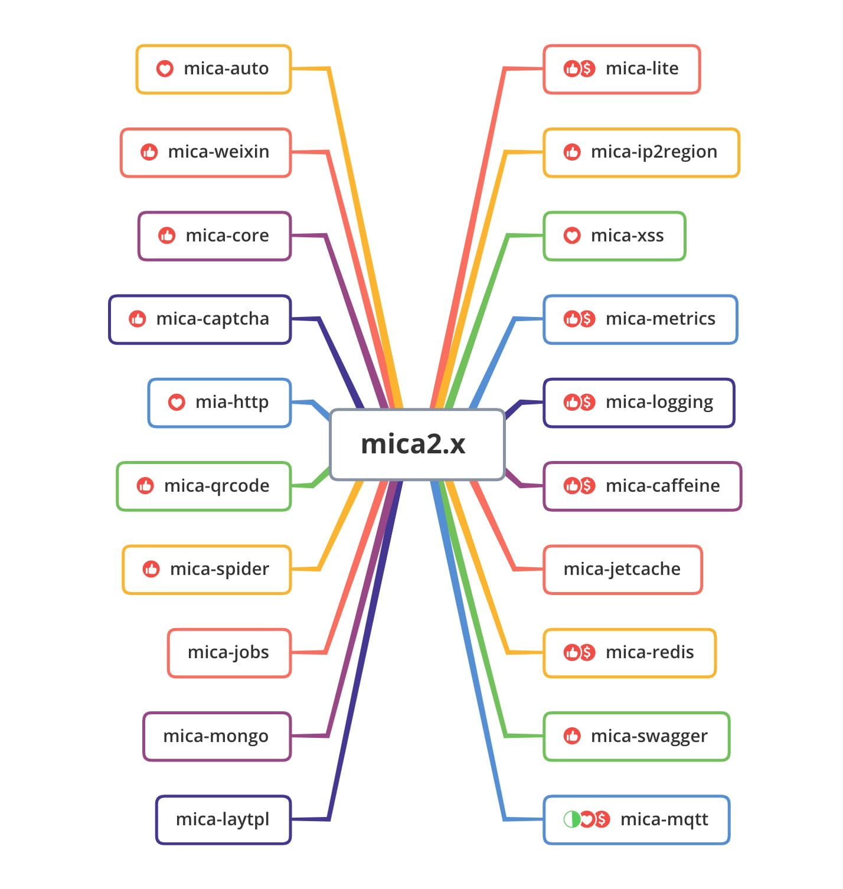

## 🌐 mica（云母）

`Mica`, Spring Cloud micro core services development package to support` web` and `webflux`.

English | [简体中文](README.md)

## 🔖 Imprint

| Latest version | mica version     | spring boot version | spring cloud version |
| -------------- | ---------------- | ------------------- | -------------------- |
| 2.5.3          | mica 2.5.x       | 2.5.x               | 2020                 |
| 2.4.9          | mica 2.4.x       | 2.4.x               | 2020                 |
| 2.1.1-GA       | mica 2.0.x~2.1.x | 2.2.x ~ 2.3.x       | Hoxton               |

## 🏷️ Version number description

The format of `release` version number is `x.x.x`, which is basically consistent with `Spring boot`.

The format of `snapshots` version number is `x.x.x-SNAPSHOT`.

`Note`: The `snapshots` version will be automatically released after `push`, and respond to and fix the latest `bug` and requirements in a timely manner. 

## 📝 Use documentation 

**Use document** See: [http://wiki.dreamlu.net (mica2.x use document)](http://wiki.dreamlu.net/guide/getting-started.html)

**Update log** Please refer to: [Mica update log](CHANGELOG.md) 

## 🌱 mica ecology

-mica-auto (Spring boot starter tool): https://gitee.com/596392912/mica-auto 

-mica-weixin (spring boot starter of jfinal weixin): https://gitee.com/596392912/mica-weixin 

-mica-mqtt (mqtt component based on t-io implementation): https://gitee.com/596392912/mica-mqtt 

-Spring cloud microservice http2 solution (h2c): https://gitee.com/596392912/spring-cloud-java11 

-mica-security (mica permission system vue is under reconstruction): https://gitee.com/596392912/mica-security

## 🐛 Known issues

Method issue generated by lombok: https://github.com/rzwitserloot/lombok/issues/1861

For the attribute name of the xX class, the first is lowercase and the second is uppercase bean attribute name, Map -> Bean or Bean -> Map has a problem.

Do not intend to be compatible, the new version to be lombok repair. 

## 📌 Open Source Agreement

**Soft work number**: `2020SR0411603`

### 📄 Agreement explanation

LGPL ([GNU Lesser General Public License](http://www.gnu.org/licenses/lgpl.html))

LGPL is an open source agreement of GPL designed mainly for the use of class libraries. It is different from the GPL requirement that any software that uses/modifies/derives the GPL library must adopt the GPL agreement. LGPL allows commercial software to use LGPL class libraries through class library links without the need for open source commercial software codes. This allows the open source code that adopts the LGPL agreement to be referenced, published and sold by commercial software as a class library. 

However, if the code of the LGPL agreement is modified or derived, all the modified code, the additional code involving the modified part and the derived code must adopt the LGPL agreement. Therefore, the open source code of the LGPL agreement is very suitable as a third-party class library to be cited by commercial software, but it is not suitable for commercial software that hopes to use the LGPL agreement code as the basis for secondary development through modification and derivation. 

### ✅ User rights

It is allowed to be used for learning, completion, company projects, private work, etc. for free in the form of introducing the source code without changing it.

Modify the code in special circumstances, but still want to close the source requires the author's consent.

For not authorized and do not follow the LGPL open source or secondary commercialization, we will pursue in the end.

Please note for reference: reference from mica: https://github.com/lets-mica/mica, please also follow the LGPL agreement.

`Note`: If the prohibition clause is discovered, it has the right to recover the authorization fee of **19999**.

### 🗃️ Authorized users (best practice)

-`pigx`, the most powerful microservice in the universe (a must for architects): https://pig4cloud.com

-`bladex` complete online solution (necessary for enterprise production): https://bladex.vip 

## 🔍️ Related links

-mica source code Github: [https://github.com/lets-mica](https://github.com/lets-mica)

-mica source code Gitee (code cloud): [https://gitee.com/596392912/mica](https://gitee.com/596392912/mica)

-mica performance pressure test: [https://github.com/lets-mica/mica-jmh](https://github.com/lets-mica/mica-jmh)

-Document address (official website): [http://wiki.dreamlu.net](http://wiki.dreamlu.net/guide/getting-started.html)

-Document address (Yuque-Follow and subscribe): [https://www.yuque.com/dreamlu](https://www.yuque.com/dreamlu)

## 🍻 Open source recommendation

-`Avue` a magical framework based on vue configurability: [https://gitee.com/smallweigit/avue](https://gitee.com/smallweigit/avue)

-`pig` the strongest microservice in the universe (a must for architects): [https://gitee.com/log4j/pig](https://gitee.com/log4j/pig)

-`SpringBlade` complete online solution (required for enterprise development): [https://gitee.com/smallc/SpringBlade](https://gitee.com/smallc/SpringBlade)

-`IJPay` payment SDK makes payment at your fingertips: [https://gitee.com/javen205/IJPay](https://gitee.com/javen205/IJPay)

-`JustAuth` The most complete open source library that integrates third-party login in history: [https://github.com/zhangyd-c/JustAuth](https://github.com/zhangyd-c/JustAuth)

-`spring-boot-demo` Deep learning and actual spring boot project: [https://github.com/xkcoding/spring-boot-demo](https://github.com/xkcoding/spring-boot-demo ) 

## 💚 Thanks

Thanks to the free open source license provided by JetBrains:

Thanks to the support of `Rumeng Technology VIP` **Little friends**, for more **VIP** information, please visit: https://www.dreamlu.net/vip/index.html

## 📱 WeChat public account

Wonderful content recommended daily! ! !

## 🏗️ Contributor

 