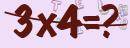
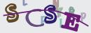

# mica 验证码

## 图示






## 功能和特点
1. 验证码生成
2. 验证码缓存
3. 内置字体

## 使用
### maven
```xml
<dependency>
  <groupId>net.dreamlu</groupId>
  <artifactId>mica-captcha</artifactId>
  <version>${version}</version>
</dependency>
```

### gradle
```groovy
compile("net.dreamlu:mica-captcha:${version}")
```

## 配置
| 配置项                     | 默认值               | 说明                                |
| ------------------------- | ------------------- | ---------------------------------- |
| mica.captcha.captcha-type | RANDOM（随机）       | RANDOM（随机）MATH（算术）           |
| mica.captcha.cache-name   | captcha:cache#5m，  | cache 名称，配合 mica-caffeine、mica-redis、mica-redisson 使用5分钟缓存 |

注意： 
1. 单服务可以采用 `guava`、`ehcache`、`caffeine` 等内存缓存。
2. 分布式下可以使用 `redis` 等。
3. 如果不是用 `spring cache`，可自行实现 `ICaptchaCache` 注册成 `Spring bean` 即可。

## 使用文档

### 导入 Bean
```java
@Autowired
ICaptchaService captchaService;
```

### 方法
```java
/**
 * 生成验证码
 *
 * @param uuid         自定义缓存的 uuid
 * @param outputStream OutputStream
 */
void generate(String uuid, OutputStream outputStream);

/**
 * 生成验二进制证码
 *
 * @param uuid 自定义缓存的 uuid
 * @return bytes
 */
byte[] generateBytes(String uuid);

/**
 * 生成验 Resource 证码
 *
 * @param uuid 自定义缓存的 uuid
 * @return ByteArrayResource
 */
ByteArrayResource generateByteResource(String uuid);

/**
 * 生成验证码 base64 字符串
 *
 * @param uuid 自定义缓存的 uuid
 * @return base64 图片
 */
String generateBase64(String uuid);

/**
 * 生成验证码
 *
 * @param uuid uuid
 * @return {ResponseEntity}
 */
ResponseEntity<Resource> generateResponseEntity(String uuid);

/**
 * 校验验证码
 *
 * @param uuid             自定义缓存的 uuid
 * @param userInputCaptcha 用户输入的图形验证码
 * @return 是否校验成功
 */
boolean validate(String uuid, String userInputCaptcha);
```