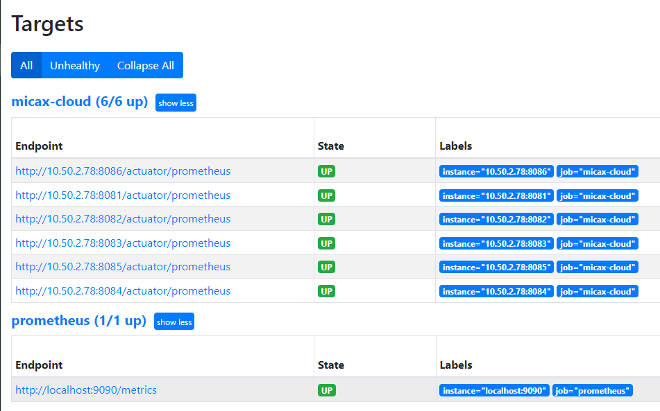

# mica-prometheus 模块

## 功能
- `Spring cloud` 对接 Prometheus `http_sd`，支持 `servlet` 和 `webflux`，建议集成到 Spring boot admin 这类非业务服务中。

## 依赖引用
### maven
```xml
<dependency>
  <groupId>net.dreamlu</groupId>
  <artifactId>mica-prometheus</artifactId>
  <version>${version}</version>
</dependency>
```

### gradle
```groovy
compile("net.dreamlu:mica-prometheus:${version}")
```

## 使用
```yaml
- job_name: micax-cloud
  honor_timestamps: true
  scrape_interval: 15s
  scrape_timeout: 10s
  metrics_path: /actuator/prometheus
  scheme: http
  http_sd_configs:
  - url: 'http://{ip}:{port}/actuator/prometheus/sd'
```

## 效果图


