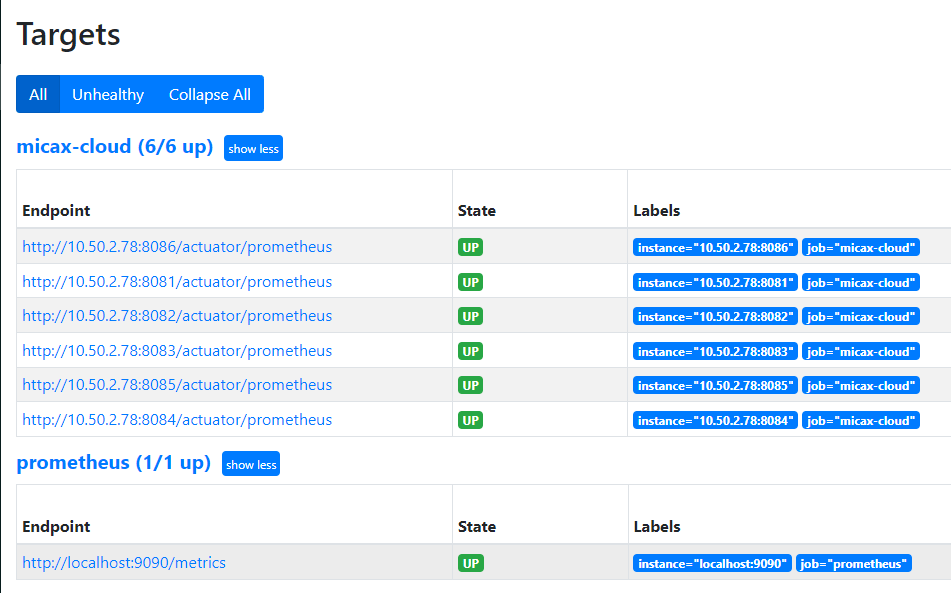

# mica-prometheus 模块

## 功能
- `Spring cloud` 对接 Prometheus `http_sd`，支持 `servlet` 和 `webflux`，建议集成到 Spring boot admin 这类非业务服务中。

## 依赖引用
### maven
```xml
<dependency>
  <groupId>net.dreamlu</groupId>
  <artifactId>mica-prometheus</artifactId>
  <version>${version}</version>
</dependency>
```

### gradle
```groovy
compile("net.dreamlu:mica-prometheus:${version}")
```

## http-sd 使用
### 添加配置
```yaml
- job_name: micax-cloud
  honor_timestamps: true
  scrape_interval: 15s
  scrape_timeout: 10s
  metrics_path: /actuator/prometheus
  scheme: http
  http_sd_configs:
  - url: 'http://{ip}:{port}/actuator/prometheus/sd'
```

### http sd basic auth
从 `4.1.1` 版本起，http sd 支持开启 Basic auth。`prometheus` 的 `http_sd_configs` 也支持 basic auth 配置，配合使用即可：

#### Spring Boot 配置
```yaml
mica:
  prometheus:
    basic-auth:
      enabled: true   # 默认 false，开启 basic auth
      username: mica  # basic auth 用户名
      password: mica  # basic auth 密码
```

#### prometheus http_sd_configs 配置
```yaml
- job_name: micax-cloud
  honor_timestamps: true
  scrape_interval: 15s
  scrape_timeout: 10s
  metrics_path: /actuator/prometheus
  scheme: http
  http_sd_configs:
  - url: 'http://{ip}:{port}/actuator/prometheus/sd'
    basic_auth:
      username: mica
      password: mica
```

### 效果图



## alert web hook

### 添加配置
```yaml
receivers:
- name: "alerts"
  webhook_configs:
  - url: 'http://{ip}:{port}/actuator/prometheus/alerts'
    send_resolved: true
```

### 自定义监听事件并处理
```java
@Async
@EventListener
public void onAlertEvent(AlertMessage message) {
	// 处理 alert webhook message
}
```